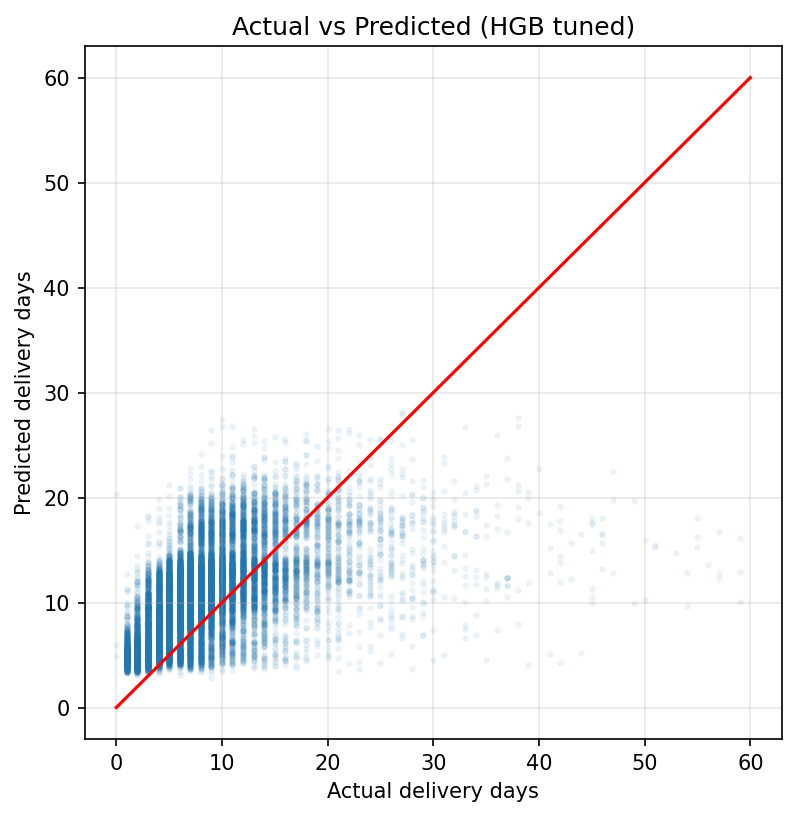

# Olist Delivery Time Prediction

Predicting delivery time for Brazilian e-commerce orders
(Olist dataset, ~96k delivered orders, 2016–2018).

**Final model:** MAE 4.08 days on a time-based test set. That is 34% better than the
naive baseline and 3x better than Olist's own estimate.

## Problem

Olist shows a delivery date at checkout. But this date is made to be safe,
not accurate: on average it is 11.5 days later than the real delivery, and
even so 7.3% of orders still arrive late. This project builds a model that
predicts the real delivery time in days.


*Almost the whole distribution sits right of zero: the estimate is a buffer,
not a prediction. The small tail left of zero is the 7.3% of late orders.*

## Results

| Model | MAE on test, days |
|:-:|:-:|
| **HGB tuned (final)** | **4.08** |
| HGB + distance feature | 4.11 |
| HistGradientBoosting | 4.19 |
| RandomForest, 9 features | 4.53 |
| Naive baseline (train mean) | 6.19 |
| Olist estimate | 13.17 |


*Each step is measured on the same time-based test set. The final model is
34% better than the naive baseline and 3x better than Olist's own estimate,
accurate enough to shrink the checkout buffer without increasing late orders.*

*Olist's 13.17 here is mean absolute error. The 11.5 days above is the average
size of the buffer itself.*

## Approach

**Data.** Nine raw CSVs joined into one order-level table. Items aggregated
per order, product and seller attributes merged in, distance computed as
haversine between customer and seller zip code centroids.

**Time-based split.** Orders sorted by purchase date, first 80% train, last
20% test (Jun–Aug 2018). A random split would leak future orders into
training. Hyperparameters tuned with TimeSeriesSplit inside the train set.
The test set was used for evaluation only, never for fitting.

**Features known at order time only.** No post-purchase signals like approval
lag or carrier pickup. The model sees price, freight, weight, volume,
category, customer and seller state, same_state, month, weekday, and
customer-seller distance.

**Feature selection.** Dropping the 4 weakest features improved MAE from 4.75
to 4.53. They added noise to the splits. Distance gave only a
small gain, 4.19 to 4.11, because state and freight already carried the
geography.

**Metric choice.** A few orders take 30+ days, and R2 squares the errors, so
these few dominate it. RandomForest got R2 = −0.19 while its MAE was
better than the naive baseline. MAE is the primary metric. Final model R2 = 0.09.

## Known limitation

Median error 4.0 days, 75% of orders within 6.5. But ~1% of orders miss by
more than 15 days, and true 30-day deliveries are predicted as 10–20. The
cause of those delays is not in the order data.



*Fast deliveries are overestimated, slow ones underestimated. The model pulls
everything toward the middle.*

## Stack

Python, pandas, scikit-learn, matplotlib. Data stored as Parquet.

## Project structure

```
data/
  raw/                  Olist dataset, 9 CSV files (not in repo)
  clean/clean.parquet   merged and cleaned, ~96k orders x 42 columns
notebooks/
  01_eda.ipynb          cleaning, feature engineering, EDA
  02_model.ipynb        baselines, model iteration, tuning
models/
  hgb_tuned.joblib      final model
  features.joblib       feature list and order
images/
```

## Reproduce

```bash
pip install -r requirements.txt
```

Create `data/raw/` and `data/clean/`, download the
[Olist dataset](https://www.kaggle.com/datasets/olistbr/brazilian-ecommerce)
and unpack the CSVs into `data/raw/`.

Run `notebooks/01_eda.ipynb` first, it builds `data/clean/clean.parquet`.
Then run `notebooks/02_model.ipynb`, which trains and evaluates the models
on that file.