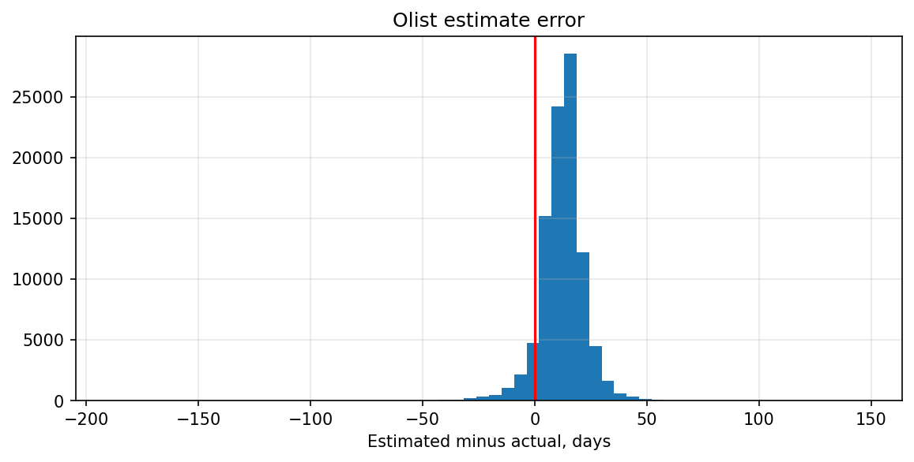
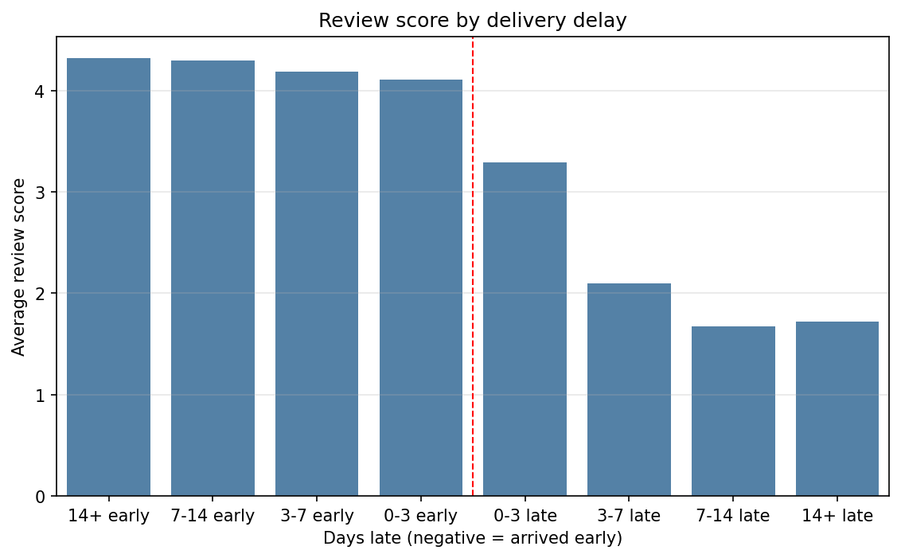
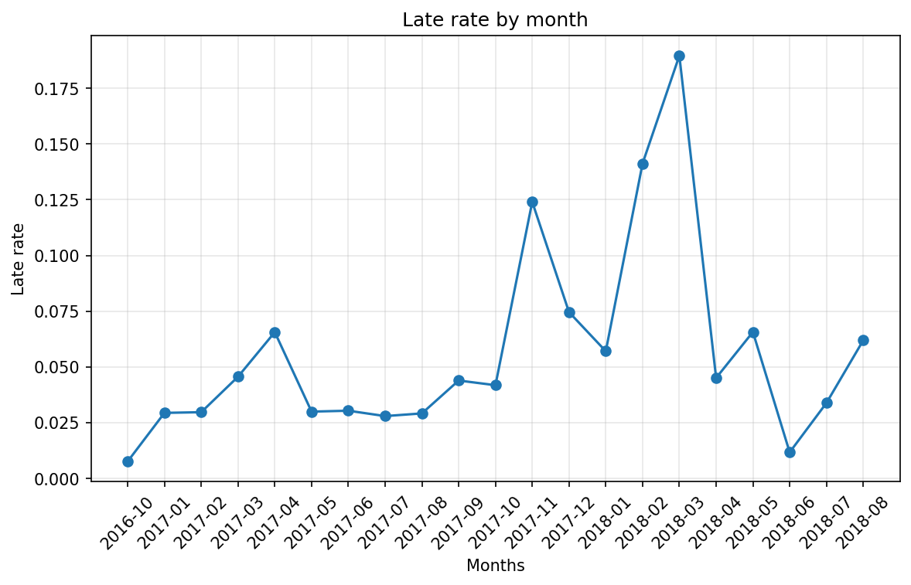
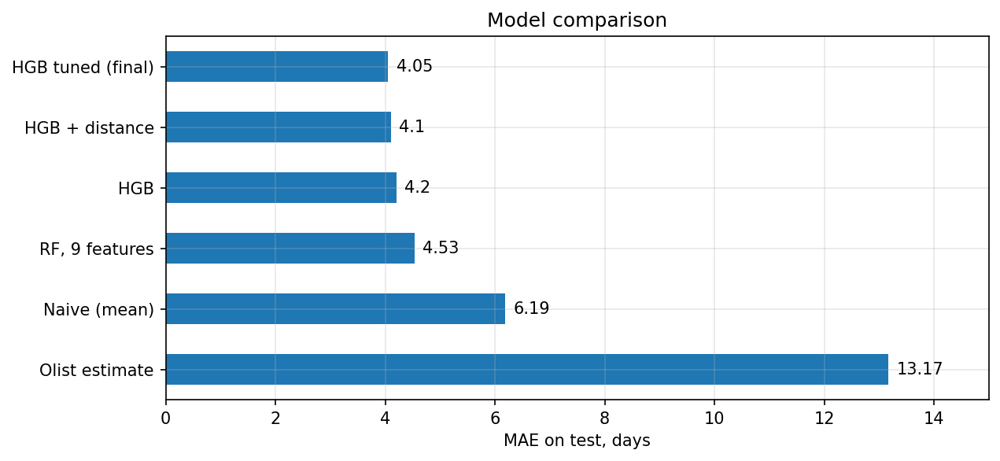

# Olist Delivery Performance

Python · pandas · scikit-learn · DuckDB · matplotlib · seaborn

I looked at 96,470 delivered orders from Olist, Brazil's largest marketplace, September 2016
to August 2018.

## Summary

Olist gives every customer a delivery date at checkout. It hits that date 93% of the time, and
pays for it with a 12-day buffer on average.

Missing it is expensive. Late orders get 2.27 stars against 4.29 for on-time ones. Late
deliveries are 6.7% of all orders and 32.5% of 1-2 star reviews.

No small group explains them. The worst 16 sellers account for 5.1% of late deliveries once
each is measured against their own routes. Geography and demand peaks explain more.

It also shows up in repeat business. Customers whose first order arrived late come back 2.52%
of the time against 3.04%. Priced out, that gap is about 4,046 over two years, so retention is
not the argument for fixing delivery.

I also tested whether a model could replace Olist's estimate. It predicts more accurately, MAE
3.55 days against 4.42 for a per-state median. It still cannot promise better. To be on time
as often as Olist, it has to promise 23.6 days against their 22.4.

## Notebooks

**[01_eda](notebooks/01_eda.ipynb)** — cleaning, delivery time, how good the promise is,
geography and seasonality

**[02_delivery_and_reviews](notebooks/02_delivery_and_reviews.ipynb)** — what a late delivery
does to the review score, and where late orders come from

**[03_prediction_model](notebooks/03_prediction_model.ipynb)** — can delivery time be
predicted at checkout, and what a promise built on the model would look like

**[04_sql_analysis](notebooks/04_sql_analysis.ipynb)** — the same questions in SQL, plus cohort
retention and what a late first order does to repeat purchases

## Where the 12 days go



Almost everything sits right of zero. The estimate works as a buffer. It tracks actual
delivery at only 0.38 correlation.

One note on the metric. Olist's date carries a time of `00:00:00`, so an order arriving at 2pm
on the promised day counts as late under a direct comparison, 8.11%. I read it as "by end of
day D", the way a customer would, which gives 6.77%.

## A late order costs two stars



Coming early buys nothing. Scores hold at 4.1 to 4.3 whether the order arrived one day or two
weeks ahead. Missing the date drops the score to 3.29 immediately, and after a week it settles
at 1.7 and goes no lower.

The penalty is one-sided, which explains the buffer. Early costs Olist nothing in reviews.
Late costs them two stars.

## Where the late orders come from

Not the sellers. Measured against the average late rate on their own destinations, 16 sellers
carry 328 of 6,381 late deliveries, 5.1%. At the loosest threshold it reaches 11.8% and no
further. Category explains as little, 4.2% to 8.0%.

Geography splits in two. The far North takes 19 to 27 days but misses the date only 3% of the
time, because the estimate already covers the distance. The Northeast is slow and unreliable
at once, AL is 21% late. RJ fits neither: average delivery at 15.3 days, yet 12% late on the
second largest volume in the country.



Late rate also tracks volume. Around 0.03 in a normal month, 0.12 in November 2017, 0.19 in
March 2018.

## Nobody comes back

3.12% of customers order twice. Month 1 retention sits between 0.2% and 0.7% across every
cohort from January 2017 to August 2018, with no trend. The curve does not decay. It starts
near zero.

Of the 2,801 who return, 36.7% come back within a week. Most of that is one cart split across
sellers rather than a second purchase. Median gap is 29 days.

A late first order is followed by a lower repeat rate, 2.52% against 3.04%. Priced out, that
gap is about 4,046 over two years, roughly 0.03% of revenue.

## Can a model do better?

Measured on a time-based test set, June to August 2018:

| | MAE, days |
|---|---|
| Naive train mean | 6.23 |
| Per-state median | 4.42 |
| **Final model, HGB + distance** | **3.55** |

Olist's estimate scores 14.04 here, but it is built to avoid being late rather than to be
accurate, so MAE is the wrong lens for it.



I set the per-state median as the bar rather than the naive mean. A model that cannot beat a
`groupby` is not worth having, and my first RandomForest did not beat it. The final model
comes in 20% under the median.

The biggest single gain came from matching the loss to the metric. Switching squared error to
absolute error moved validation MAE from 5.09 to 4.52, more than any model or feature I tried.
Tuning changed nothing.

**A better prediction does not give a shorter promise.** A prediction sits in the middle of the
distribution, so half the orders arrive after it. Turning it into a promise means adding a
margin, and the margin has to cover the worst orders. Those are exactly what the model misses:
R2 is 0.23, and orders that really take 30+ days get predicted at 10 to 20. Per-state margins
help, from 10.3 days in SP to 30.2 in CE, but not enough to get under Olist's 22.4.

## What I would recommend

1. **Widen the promise before known peaks.** November 2017 ran 7,237 orders against 4,446 the
   month before, and late rate went from 0.04 to 0.12. The promise stayed the same.

2. **Set the margin per route.** SP needs 10 days, CE needs 30. One number cannot serve both.

3. **SLA for the 16 flagged sellers.** A small lever at 5.1% of late orders, but the list is
   short and each seller is measured against their own routes. Notebook 02 has it.

4. **Do not replace the estimate with this model yet.** It predicts better and promises worse.
   A working version would need per-route margins and refitting every season.

5. **Do not build the case on retention.** The repeat-rate gap prices out at 4,046 over two
   years. At a 3% repeat rate there is nothing to retain, and the argument stays with reviews.

## Method notes

**Time-based split.** Train through May 2018, test on late May to August. A random split would
leak future orders into training. Tuning ran with TimeSeriesSplit inside the training set, and
the test set was scored once.

**Only features known at checkout.** No approval time, no carrier pickup. Delivery time drops
from 11-17 days in 2017 to 8-10 from July 2018, which is why test MAE comes in below
validation MAE.

## Reproduce

```bash
pip install -r requirements.txt
```

Download the [Olist dataset](https://www.kaggle.com/datasets/olistbr/brazilian-ecommerce) into
`data/raw/` and run the notebooks in order. 01 builds `data/clean/clean.parquet`, which 02 and
03 both read. 04 queries the raw CSVs directly through DuckDB and does not depend on 01.